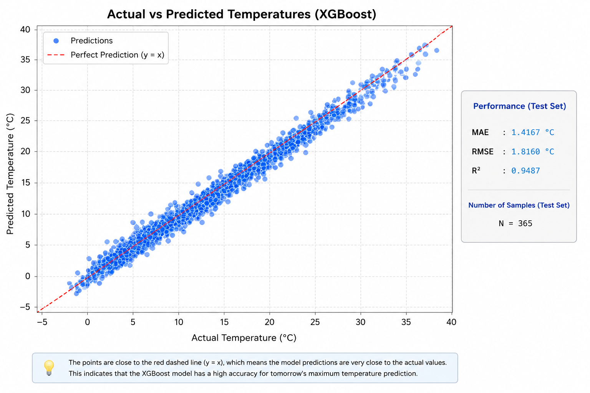
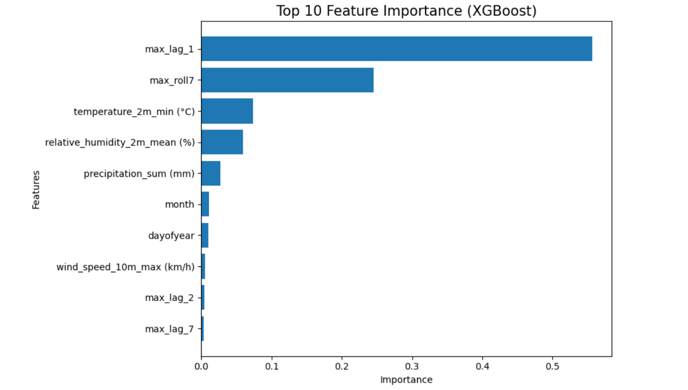
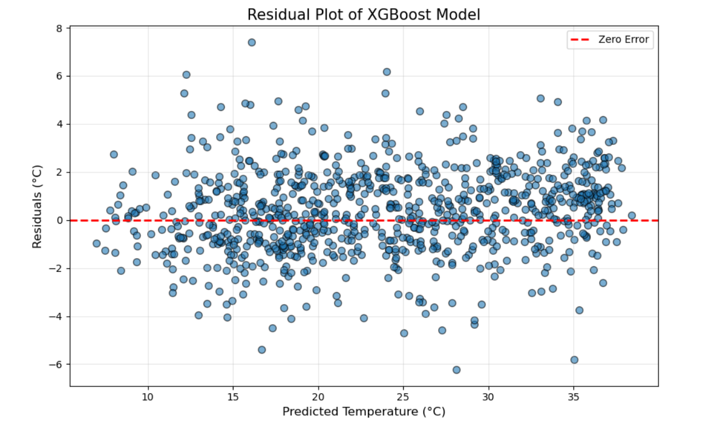
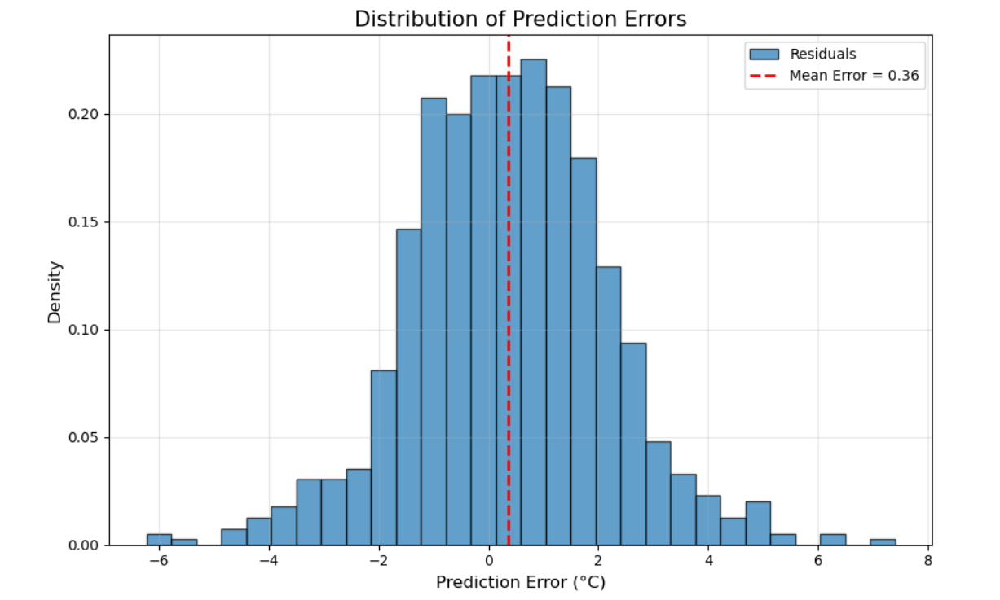

# 🌡️ Tomorrow Temperature Forecast using Machine Learning

## 📌 Project Overview

This project aims to predict the **maximum temperature of the next day** using historical weather data and Machine Learning techniques.

The project follows a complete machine learning workflow, including data preprocessing, feature engineering, model training, model comparison, performance evaluation, and visualization.

Three regression models were developed and compared to identify the most accurate approach for short-term weather forecasting.

---

## 🎯 Objectives

- Predict tomorrow's maximum temperature.
- Explore and preprocess historical weather data.
- Engineer informative time-based features.
- Compare multiple regression algorithms.
- Select the best-performing model based on evaluation metrics.

---

## 📂 Dataset

The dataset contains historical daily weather observations collected from **Open-Meteo**.

### Features include:

- Maximum Temperature
- Minimum Temperature
- Relative Humidity
- Wind Speed
- Precipitation
- Date

---

## ⚙️ Data Preprocessing

The following preprocessing steps were performed:

- Handling missing values
- Date conversion
- Feature selection
- Data normalization (where required)
- Train-Test Split

---

## 🧠 Feature Engineering

To improve prediction performance, several temporal features were created:

- Lag 1
- Lag 2
- Lag 7
- Lag 14
- Rolling Mean
- Month
- Day of Year

These engineered features allow the model to capture temporal dependencies in weather patterns.

---

## 🤖 Machine Learning Models

Three regression models were trained and evaluated:

- Linear Regression
- Random Forest Regressor
- XGBoost Regressor

---

## 📊 Model Evaluation

The models were evaluated using:

- Mean Absolute Error (MAE)
- Root Mean Squared Error (RMSE)
- R² Score

### Model Comparison

| Model | MAE | RMSE | R² Score |
|-------|------:|------:|------:|
| Linear Regression | 1.658 | 2.139 | 0.935 |
| Random Forest | 1.482 | 1.898 | 0.949 |
| **XGBoost** ⭐ | **1.417** | **1.816** | **0.949** |

After comparison, **XGBoost** achieved the best predictive performance and was selected as the final model.

---

## 📈 Visualizations

The project includes several visualizations to better understand model performance:

- Correlation Heatmap
- Actual vs Predicted Values
- Feature Importance (XGBoost)
- Residual Plot
- Distribution of Prediction Errors

---

## 📁 Project Structure

```
Tomorrow-Temperature-Forecast/
│
├── data/
│   └── meteo2.csv
│
├── notebook/
│   └── Tomorrow_Temperature_Forecast.ipynb
│
├── model/
│   └── xgb_temp_model.pkl
│
├── images/
│   ├── actual_vs_predicted.png
│   ├── feature_importance.png
│   ├── residual_plot.png
│   └── error_distribution.png
│
├── requirements.txt
│
├── README.md
│
└── LICENSE
```

---

## 🚀 Technologies Used

- Python
- Pandas
- NumPy
- Matplotlib
- Scikit-learn
- XGBoost
- Joblib

---

## 💻 Installation

Clone the repository:

```bash
git clone https://github.com/your-username/Tomorrow-Temperature-Forecast.git
```

Install the required packages:

```bash
pip install -r requirements.txt
```

Run the Jupyter Notebook:

```bash
jupyter notebook
```

---

## 📌 Future Improvements

Possible future enhancements include:

- Hyperparameter Optimization
- LSTM-based Deep Learning Model
- Multi-day Temperature Forecasting
- Additional Meteorological Variables
- Real-time Weather API Integration

---

## 📷 Project Preview

### Actual vs Predicted

<p align="center">

</p>

---

### Feature Importance

<p align="center">

</p>

---

### Residual Plot

<p align="center">

</p>

---

### Distribution of Errors

<p align="center">

</p>

---

## 📄 License

This project is licensed under the MIT License.

---

## 👨‍💻 Author

**Oussama Ghajdaoui Alaoui**

Machine Learning • Data Science • Artificial Intelligence

If you found this project useful, consider giving it a ⭐ on GitHub.
